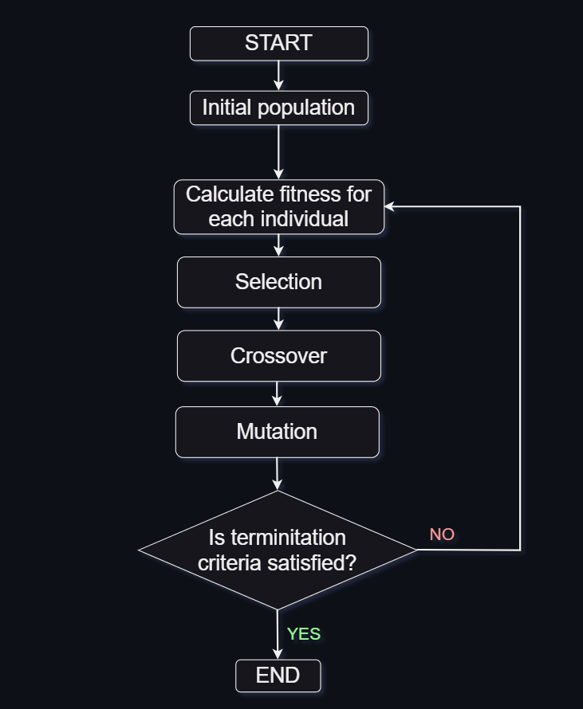

<h2 id="test">Table de matière</h2>
<ul>
<li><a href="#intro">Introduction</a></li>
<li><a href="#algo">Algorithme Génétique</a></li>
<li><a href="#st">Structure du projet</a></li>
<li><a href="#test">test</a></li>
</ul>

<h2 id="intro">Introduction</h2>

Ce projet est une implémentation d'un algorithme génétique distribué utilisant le framework Jade. 
L'algorithme génétique distribué est une approche algorithmique qui consiste à utiliser plusieurs algorithmes génétiques pour résoudre une tâche commune. 
Dans cette méthodologie, de nombreux algorithmes sont utilisés simultanément, tous cherchant à résoudre le même problème. Une fois que ces algorithmes ont terminé leurs tâches individuelles, 
le meilleur individu de chaque algorithme est sélectionné. Ensuite, l'individu le plus exceptionnel parmi eux est choisi comme solution ultime au problème en cours. Cette approche, souvent appelée le "island model", 
représente l'une des stratégies les plus populaires dans le domaine des algorithmes génétiques distribués, malgré l'existence d'autres approches. Le terme "island model" provient de l'analogie avec l'isolement de populations, 
similaires aux populations de créatures réelles résidant sur différentes island.

<h2 id="algo">Algorithme Génétique</h2>

Les algorithmes génétiques sont une classe d'algorithmes d'optimisation inspirés par le processus de sélection naturelle et l'évolution biologique. 
Ils sont utilisés pour résoudre des problèmes complexes en générant itérativement des solutions potentielles et en les améliorant au fil du temps. 
L'idée fondamentale derrière les algorithmes génétiques est de simuler les mécanismes de l'évolution biologique, tels que la reproduction, la mutation et la sélection naturelle, pour trouver des solutions optimales ou proches de l'optimalité.

<h2 id="st">Structure du projet</h2>

<h2 id="test">Test</h2>
<h4> SMA </h4>

<h4> Island </h4>

